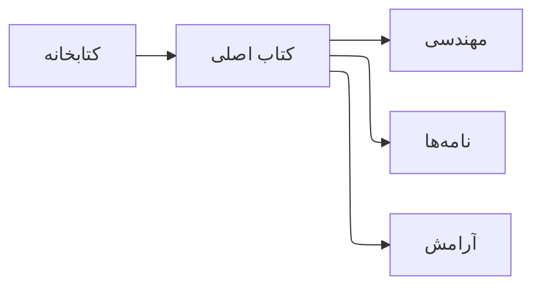

# خوش آمدید

این **کتاب من** است — نه یک موضوع تکی، بلکه خانه‌ای برای نوع‌های مختلف نوشتاری که هنوز شبیه من می‌مانند.

کتاب در **بخش‌ها** سازمان‌دهی شده:

- **مهندسی** — معماری، ابزارها، مهارت
- **نامه‌ها** — شخصی، صمیمی، گاه عاشقانه
- **آرامش** — یادداشت‌های آهسته‌تر درباره توجه و معنا

هر بخش لحن خودش را دارد. سایت آن‌ها را بخش‌های یک اثر می‌بیند، چون نویسنده یک نفر است — حتی وقتی موضوع عوض می‌شود.

## چطور بخوانید

از هر جایی شروع کنید. فصل‌ها فایل‌های مارک‌داون مستقل‌اند. اگر فقط نوشته فنی می‌خواهید، در مهندسی بمانید. اگر تصویر کامل‌تری از فکر من می‌خواهید، بین بخش‌ها بگردید.

> یک کتابخانه. یک کتاب اصلی. چند اتاق درونش.

<!-- ad:in-content-1 -->

## نمونه رسانه

برای تصویر در مارک‌داون از مسیر `public/images/` استفاده کنید:

``

---

*book.mostafaeffati.com*
