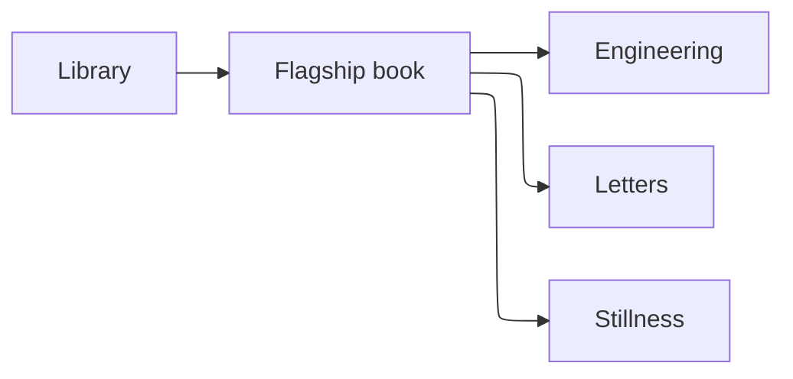

---
title:
  en: Introduction
  fa: مقدمه
description:
  en: What this book is, who it is for, and how the parts fit together.
  fa: این کتاب چیست، برای چه کسی است و بخش‌ها چگونه کنار هم قرار می‌گیرند.
order: 1
tags: [meta]
published: true
---

# Welcome

This is **my book** — not a single topic, but a home for different kinds of writing that still sound like me.

It is organized in **parts**:

- **Engineering** — architecture, tooling, craft
- **Letters** — personal, intimate, sometimes romantic
- **Stillness** — slower notes on attention and meaning

Each part has its own tone. The site treats them as sections of one work, because the author is one person — even when the subject changes.

<!-- ad:in-content-1 -->

## How to read

You can start anywhere. Chapters are standalone markdown files. If you only want technical writing, stay in Engineering. If you want the full picture of how I think, wander between parts.

> One library. One flagship book. Many rooms inside it.

<!-- ad:in-content-1 -->

---

*book.mostafaeffati.com*
